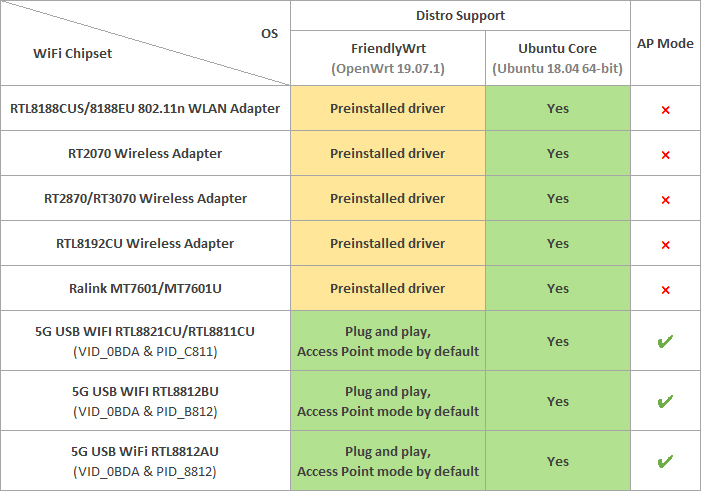

## Nanopi r2s openwrt 自用固件

     

### 代码说明

本库派生自 [klever1988/nanopi-openwrt](https://github.com/klever1988/nanopi-openwrt)，并由该作者主力维护

### 固件说明

本固件是friendlywrt和openwrt混编的结果，前者为基后者为主。

minimal版本就是Lean版opwenwrt的最小编译，加入Turbo加速和一两个VPN插件和广告插件跟KMS等（不含多播），是原作者主力维护的版本

r2s-friendlywrt-lean版是基于[fanck0605/friendlywrt-lean](https://github.com/fanck0605/friendlywrt-lean) 编译的版本，由该作者主动维护，代码比较整洁。

而minimal2 ——本人日常版本—— 则是在minimal版的基础上加入最基本的NAS应用：网络共享(samba)、下载工具和硬盘休眠，以及家庭网络必备的minidlna。再挂个QOS留用。软路由空间大，没个samba实在是浪费。

多播还是没有，因为我这边好像不支持多播，测试不了所以不想加（好吧，因为iptv所以一起加了）。另，[关于MWAN3掉线的解决方案](https://koolshare.cn/thread-150601-1-1.html)（可以改用114DNS）

对了，docker也没有。

usb-wifi驱动有，就网上常见的芯片，👇

建议不要对它抱有太大的期望。👆

### 发布地址：

[下载传送门](https://github.com/kongfl888/nanopi-openwrt/releases)

[friendlywrt官版](https://github.com/kongfl888/nanopi-openwrt/actions?query=workflow%3A%22r2s%20%E5%AE%98%E7%89%88friendlywrt%22)（打 ✔ 的）

（彻底解压出来，img包才是最终固件格式）

### 温馨提示：

路由器登陆页面： http://friendlywrt/

默认用户名是root, 密码是 password 或 空密码。

tf卡直接影响系统启动速度。建议使用C10+卡，卡容量大小至少4GB。开机后连不上，等待5分钟后直接断电重启！

### 更新说明：

[核心更新内容](https://github.com/klever1988/nanopi-openwrt/blob/master/CHANGELOG.md)

未知问题：bpfilter/netfilter偶尔抽风导致网口连接丢失，具体原因未知。

（所有minimal版本都存在该现象）

#### 本固件(minimal版本)NAT基准性能测试：

