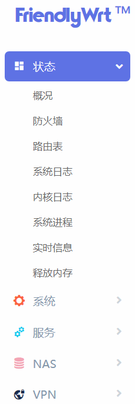

# 项目清零

    

``` 

改动大，项目重开，同时将打算以原生openwrt19.07为主（Original），Lean版暂时停止

```


[新项目地址](https://github.com/kongfl888/OpenWrt4R2S)

.............

> 一些旧的指引

### 地址

[下载传送门](https://github.com/kongfl888/nanopi-openwrt/releases)

[网盘分流](https://github.com/kongfl888/nanopi-openwrt/blob/master/README.txt)

（彻底解压出来，img包才是最终固件格式）

### 自选软件包

含MWAN3负载均衡、IPTV助手、adgurdhome、adbuby-plus、syncdial多拨、[r2s刷机助手](https://github.com/kongfl888/luci-app-r2sflasher/releases)、[定时重拨助手](https://github.com/kongfl888/luci-app-autorewan/releases)。

可直接上传到路由器安装：[IPK分流](https://kongfl888.lanzous.com/b04sj203c) （密码:abw4）

[其他R2S可用的软件包](https://github.com/kongfl888/r2s-openwrt-packages/blob/master/README.md)

### 刷机

你可以有三种方法

一、打开WEB页面，
	
使用 [R2S刷机](https://github.com/kongfl888/luci-app-r2sflasher/releases)

二、打开SSH，

``cd /tmp && wget https://raw.githubusercontent.com/kongfl888/nanopi-openwrt/master/scripts/flash_rom.sh
flash_rom /tmp/rom.img.gz /dev/mmcblk0 gz``

三、PC端刷卡

1、Ubuntu下（其中/dev/sdX为TF卡的真实路径）

``sudo dd if=out/FriendlyWrt_20xxxx_NanoPi-R1_armhf_sd.img bs=1M of=/dev/sdX``

2、Windows系统

下载 [balenaEtcher](http://www.ksite.xyz/contents/balena-etcher.html)，插卡刷机
    
### 登录

路由器登陆页面： http://friendlywrt/

默认用户名是``root``, 密码是 ``password`` 或 ``空密码``。


固件菜单预览

Minimal2  -  Lite2

 .  -  . 

